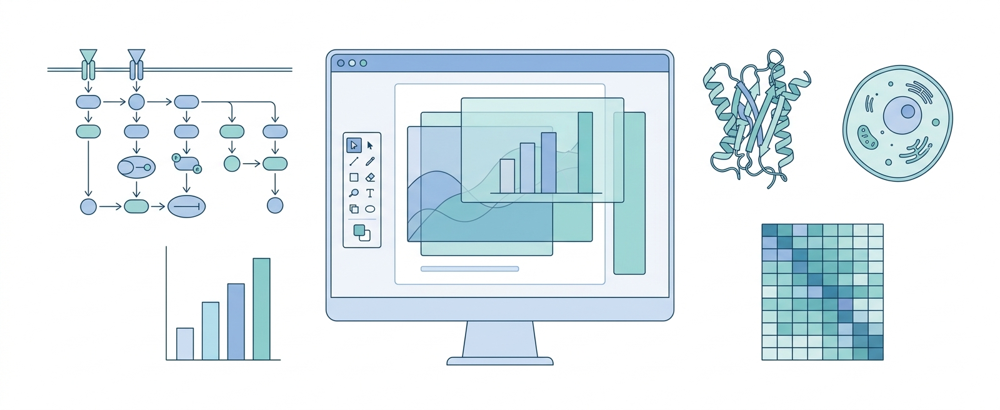
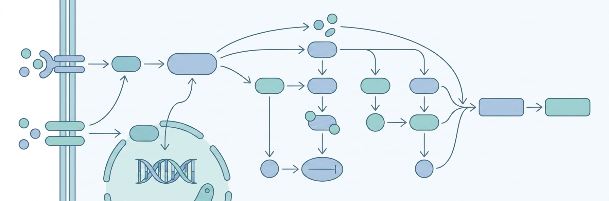
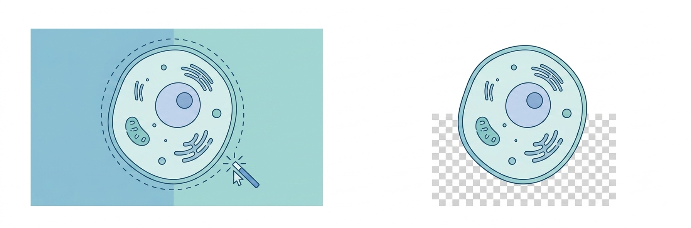

# SciEdit / NanoPro — 科研制图桌面编辑器

<p align="center">
  
</p>

<p align="center">
  <b>PS 的像素编辑　·　BioRender 的素材拼图　·　AI 生成与抠图</b><br>
  一个本地、离线可用、数据不上云的科研制图工作台。
</p>

<p align="center">
  
  
  
  
</p>

> 基于 **PySide6 + QGraphicsView + NumPy/OpenCV**。对标 Photoshop / BioRender 的核心工作流，内置 AI 生成、AI 抠图与本地离线抠图。**所有 API Key 只存在你本机，绝不进程序、日志或仓库。**
>
> 本仓库是 **Qt/PySide6 重写版**；早期的 WebView/pywebview 版本是它的前身，二者为独立代码库。

---

## ✨ 亮点

### 🔗 智能连接线 —— 对齐 BioRender 的 Smart Connect



画机制图 / 通路图的核心。鼠标移到对象上**自动浮现 4 个边中点蓝锚点**，从一个对象拖到另一个 → 连线**精准落在边的中心**，并在你**移动 / 缩放对象时自动跟随**。

- 箭头 / 直线工具同样吸附锚点：两端都吸到对象 → 自动变**跟随式连线**；自由画则是静态形状
- 连线形状可切 **直线 / 曲线 / 折线**，改颜色 / 虚线 / 删除（右键）
- 支持连到**导入 SVG 里的单个元素**（元素级连接）

### 🖼 素材库 —— 万张素材也不卡


连接一个本地素材文件夹（子文件夹 = 分类，递归任意深度），**20 万张素材后台秒扫不卡 UI**。

- 顶部 **Tab 切换**「本地库 / 抠出素材」，搜索置顶，次要操作收进 ⚙ 菜单（BioRender 式干净布局）
- 缩略图**大小滑块**（持久记忆）+ 悬停大图预览 + 高分屏清晰解码
- **⭐ 收藏 / 🕘 最近** 虚拟分类；拖 / 单击放到画布（智能缩放 + 磁吸对齐）
- **✂ 拆分合集**：把「一张纸排了 20 个图标」的合集大图按空白沟槽切成单个图标
- **✂ 批量裁透明边**：自动裁掉素材四周透明留白（自适应忽略淡水印），框 = 真正的图

### ✂ AI 抠图 / 拆解 —— 可完全离线



- **本地离线**：内置 u2netp ONNX 模型，**不用 Key、不用联网**，一键抠主体
- 在线可选：grsai 图生图编辑 / PPIO Qwen-Image-Edit / OpenAI image-edit 兼容中转 / rembg
- 配合**魔棒 / GrabCut / 套索**像素级精修；自动拆解把整图分成独立透明素材

### ⚡ 其它打磨

- **启动秒开**：大素材库扫描挪到后台线程，窗口构造 9.3s → **0.1s**
- 图层面板**拖拽调层级**、非破坏蒙版、对齐 / 分布、翻转 / 旋转
- AI 文生图 / 图生图（多中转站、国内/国外节点、并行任务队列、结果自动落图层）
- AI 对话把口语需求转成可直接用的英文绘图提示词

---

## 🧭 它在 Photoshop 和 BioRender 之间的位置

|  | 本工具 | Photoshop | BioRender |
|---|:---:|:---:|:---:|
| 像素编辑 / 抠图 / 蒙版 | ✅ | ✅ | ❌ |
| 素材拼图 + 智能连接线 | ✅ | ❌ | ✅ |
| AI 生成配图 | ✅ | ⚠️ 插件 | ❌ |
| 矢量导入再编辑（SVG/PDF） | ✅ | ⚠️ | ⚠️ |
| TIFF 300dpi 投稿导出 | ✅ | ✅ | ⚠️ 付费 |
| 本地 / 离线 / 免费 / 数据私有 | ✅ | ❌ | ❌ |

一句话：**「PS 的像素编辑 + BioRender 的素材拼图 + AI 生成」的本地合体**。

---

## 📋 完整功能

**图层** 显隐 / 层级（可拖拽）/ 重命名 / 锁定 / 打组解组 / 不透明度 / 非破坏蒙版（选区生成，画布·导出·缩略图三处同源）

**选区（PS 式连续工作流）** 套索 / 魔棒 / 选区画笔 / 矩形选框；Shift 加选、Alt 减选；Ctrl 点图层载入像素；Ctrl+J 经选区抠出；选区 → 抠出 / 蒙版 / 裁剪 / 挖洞

**绘制与文字** 画笔 / 橡皮（脏矩形局部刷新）；画布内打字、拖框定宽、旋转、即时生效

**矢量** SVG / PDF 导入，元素级改色 / 改字 / 配色助手（Okabe-Ito）/ 钢笔 / 锚点编辑 / 形状（矩形·椭圆·直线·箭头）/ 打组解组，导出 SVG

**导出与工程** PNG / TIFF（写 300 DPI）；保存 / 加载工程 `.nanopro.json`（图层 + 蒙版 + 矢量 + 素材）

**界面** 深 / 浅主题，Qt-ADS 停靠面板，撤销 / 重做历史，标尺 / 参考线 / 网格磁吸，全局滚轮防误改参数，软件图标 + 任务栏图标

---

## 🔒 安全与隐私

- **API Key 只保存在本机** `~/.sciedit/config.json`（每个商家的 Key 相互隔离），界面只回显掩码尾号。
- Key **绝不**进程序日志 / 仓库 / 导出图 / 工程文件 / 窗口布局。
- 打包产物（PyInstaller）只含源码 + 模型 + 运行库，**不打包任何 Key**；冻结态也不读包内 `.env`。克隆者需各自填写自己的 Key。

---

## 🚀 从源码运行

需要 Python 3.13（3.11+ 应可用）。

```bash
pip install -r requirements.txt
python src/main.py
```

首次使用 AI 功能时，在面板「设置」里填入你自己的 API Key（仅存本机）。**AI 抠图可完全离线**：后端选「本地内置模型」，不用 Key、不用联网。

## 📦 打包（Windows）

```bash
# 1) PyInstaller 打成独立程序（onedir）→ dist/NanoPro/NanoPro.exe
python -m PyInstaller NanoPro.spec --noconfirm
# 2) Inno Setup 打成双击安装包 → Output/SciEdit_NanoPro_Setup_vX.exe
"%LOCALAPPDATA%\Programs\Inno Setup 6\ISCC.exe" NanoPro_Setup.iss
```

刻意排除 torch/CUDA 等巨物（本地抠图仅用 onnxruntime CPU 推理），独立程序约 310 MB、安装包约 94 MB。**安装包可直接在 [Releases](../../releases) 下载**（无需管理员）。

---

## 🧱 技术栈与结构

PySide6 6.11 · NumPy · OpenCV · onnxruntime · PySide6-QtAds · lxml · certifi

主类 `editor_window.py` 已按功能拆成 7 个 mixin（从 7096 行降到 ~3500 行，行为不变）：

```
src/
  main.py             入口（应用图标 / 主题）
  editor_window.py    主窗口 + UI 构建 + 撤销重做内核 + 工具分发
  editor_vector.py    SVG/PDF + 矢量编辑 + 钢笔 + 锚点 + 形状
  editor_selection.py 魔棒 / 套索 / 矩形 / 选区画笔 / 抠出 / GrabCut / AI 拆解
  editor_layers.py    图层 / 打组 / 不透明度 / 对齐 / 蒙版 / 翻转旋转
  editor_assets.py    素材库（分类树 / 懒加载 / 拆分合集 / 批量裁 / 收藏最近）
  editor_text.py      文字工具 + 画布内打字
  editor_export.py    导出 PNG/TIFF + 合成 + 工程读写
  editor_connectors.py 智能连接线（边中点锚点 + 跟随 + 形状切换）
  canvas_view.py      QGraphicsView 画布交互
  connector_item.py   连接线图元（边中点几何 + 箭头）
  layer_item.py       图层项（含非破坏蒙版）
  image_ops.py        选区 / 蒙版 / 合成 / 内容裁剪 / 合集拆分（NumPy/OpenCV）
  asset_lib.py        本地素材库扫描（分类 / 递归 / scandir 提速）
  svg_io.py           SVG 导入导出
  ai_client.py / ai_panel.py        AI 文生图 / 图生图
  chat_client.py / chat_panel.py    AI 对话（提示词生成）
  seg_client.py       AI 抠图（本地 onnx / grsai / PPIO / rembg / HTTP）
  config.py           本机配置 / Key（~/.sciedit，绝不进仓库）
  theme.py / icons.py 深浅主题 / 矢量图标
  models/u2netp.onnx  本地抠图模型
NanoPro.spec          PyInstaller 配置
NanoPro_Setup.iss     Inno Setup 安装包配置
```

---

## 📝 许可

暂未指定开源许可（默认保留所有权利）。如需开源复用，请先与作者确认。
